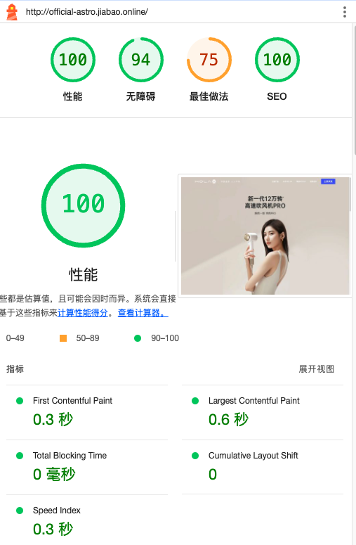
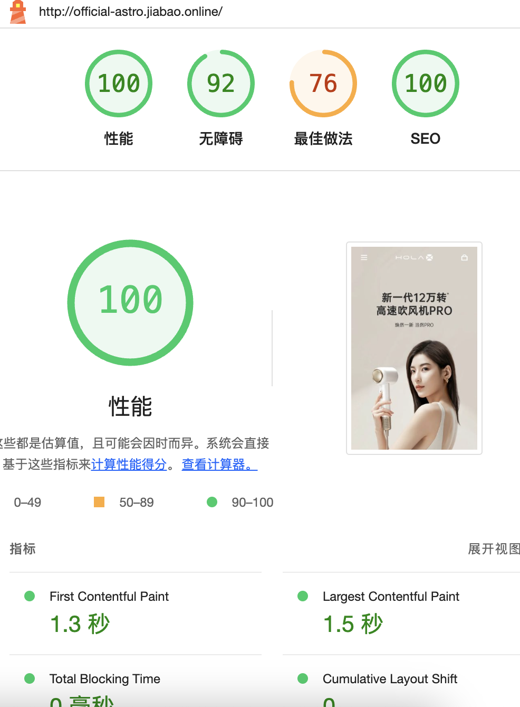

# 基于 ASTRO 的企业官网模板
> 该项目基于某公司定制，职位接口、图片资源皆为线上资源，若您需要使用，请按自身需要修改。

> 此外还有一个基于Nuxt3的全屏滚动企业官网，感兴趣可以到 [https://github.com/CallBoson/official-nuxt3](https://github.com/CallBoson/official-nuxt3)

此项目基于某公司官网，使用 Astro 进行为期两周的重构，并进行了一些优化。

模板含企业产品展示、企业介绍、招聘等页面，并且分移动端和 PC 端，响应式设计友好。

基于 ASTRO 的 SSG，几乎零 JS，SEO 友好。超低延迟。

## 线上体验：[http://official-astro.jiabao.online/](http://official-astro.jiabao.online/)

## lighthouse 测试结果：

> 注意：此 demo 网站没有使用 https，因此影响了最佳做法分数，但整体性能和 SEO 是非常高的。

- PC
  

- 移动
  

运行要求
`node >= 18`

```bash
# 安装依赖
npm install

# 开发环境运行
npm run dev

# 生产环境构建
npm run build

# 生产环境运行
npm run preview
```

## 特性

- 响应式设计，无论是不同屏幕的移动端或平板、PC，都可兼容显示。
- 部分页面有桌面端和移动端两套代码。

## 技术栈

- Astro
- TailwindCSS
- popperjs(hover 菜单)

## 重构优化项：

- 减少大量 JS 代码，几乎 0 JS 代码，下拉菜单，弹窗等统一用 input + label 实现
- 项目结构重构
- 响应式逻辑重构
- 图片几乎全部改用 webp

考虑到职位内容变更频率低，此项目渲染模式为 SSG，在职位列表页面和职位详情所显示的数据皆为构建时预获取，因此当数据发生变更时，需要重新构建部署。若需要实现数据实时更新，可以考虑使用 SSR 或 ISR 模式。详情请查看 Astro 官网。

## 部署

运行 `npm run build` 后，将 `dist` 目录下的文件部署到服务器即可。
